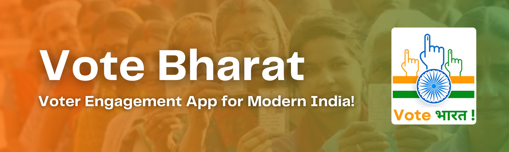
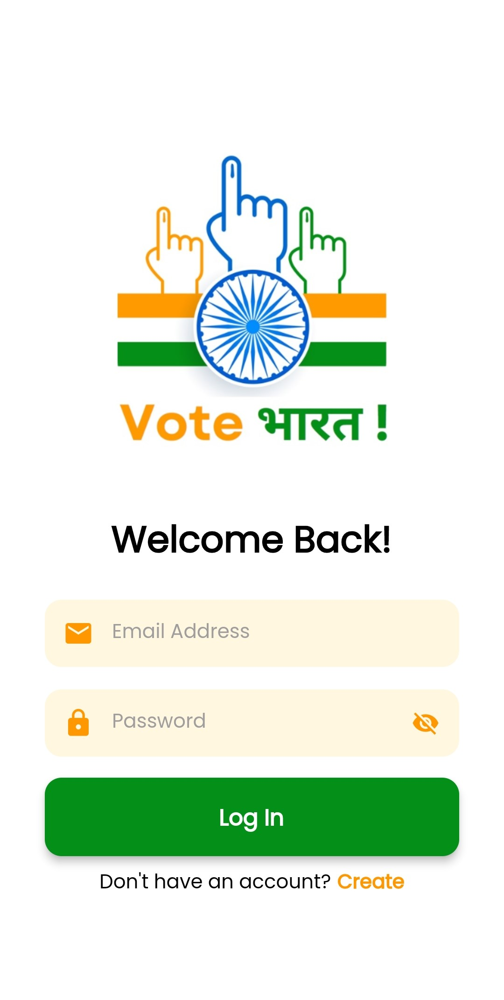
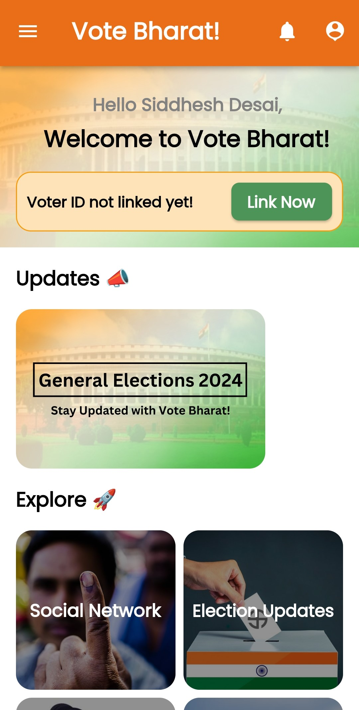

<a name="readme-top"></a>

[![Contributors][contributors-shield]][contributors-url]
[![Forks][forks-shield]][forks-url]
[![Stargazers][stars-shield]][stars-url]
[![Issues][issues-shield]][issues-url]
[![LinkedIn][linkedin-shield]][linkedin-url]

<!-- PROJECT LOGO -->
<br/>
<div align="center">
  <a href="https://github.com/siddhesh-desai/vote-bharat">
    
  </a>
    <br>
    <br>

  <h3 align="center"><b>Vote Bharat</b></h3>

  <p align="center">
    Vote Bharat! is a one-stop mobile application designed to inspire and engage youth and people of India to vote. The app features a social network where users can interact, share updates, and participate in voting-related quizzes and challenges. The app also includes a voter education section with short videos on elections, voting, and democracy. Users can apply for a voter ID card and track their real-time voting status through a QR code scan feature available at polling booths. The app supports multilingualism and offers push notifications, referral points, and rewards for participation. The app aims to create transparency and encourage people to exercise their right to vote.
    <br />
    <br>
    <a href="https://github.com/siddhesh-desai/vote-bharat"><strong>Explore the docs »</strong></a>
    <br />
    <a href="https://github.com/siddhesh-desai/vote-bharat">View Demo</a>
    ·
    <a href="https://github.com/siddhesh-desai/vote-bharat/issues">Report Bug</a>
    ·
    <a href="https://github.com/siddhesh-desai/vote-bharat/issues">Request Feature</a>

  </p>
</div>

<!-- ABOUT THE PROJECT -->
<br>

## ♾️ About The Project

Vote Bharat! is an innovative and comprehensive mobile application developed to inspire and engage the youth and people of India in the democratic process. Designed as a one-stop platform, the app aims to encourage voter participation and create transparency in the electoral system. With its user-friendly interface and unique features, Vote Bharat! strives to empower citizens to exercise their fundamental right to vote.

At the heart of the Vote Bharat! app is its vibrant social network, which allows users to connect, interact, and share updates related to voting. By fostering a sense of community, the app encourages discussions, collaborations, and the exchange of ideas on various political and social issues. Users can follow and engage with fellow voters, political leaders, and organizations, thereby fostering a strong and informed voter base.

One of the key features of Vote Bharat! is its interactive voting-related quizzes and challenges. These engaging activities educate users about the significance of elections, the importance of voting, and the functioning of democracy. By gamifying the learning process, the app aims to make civic education enjoyable and accessible to users of all ages.

To further enhance voter education, the app includes a dedicated section with short videos on elections, voting processes, and the democratic system. These videos provide concise and easy-to-understand information, helping users gain a deeper understanding of their rights and responsibilities as voters. By promoting voter literacy, the app aims to empower citizens to make informed choices during elections.

Vote Bharat! also streamlines the process of obtaining a voter ID card by providing a seamless application process within the app. Users can easily submit their details and necessary documents, ensuring a hassle-free registration process. Additionally, the app offers a convenient feature that allows users to track their real-time voting status through a QR code scan at polling booths. This transparency helps users stay updated on their voting eligibility and strengthens their confidence in the electoral system.

The app caters to the diverse linguistic landscape of India by supporting multiple languages. Users can access the app's content, quizzes, and videos in their preferred language, ensuring inclusivity and accessibility for all citizens.

Vote Bharat! goes beyond traditional engagement strategies by employing push notifications, referral points, and rewards to encourage active participation. Users receive timely reminders about election dates, polling booth locations, and important updates, ensuring they never miss an opportunity to cast their vote. By rewarding users for their engagement and referrals, the app fosters a sense of achievement and motivates individuals to spread the message of active citizenship.

Built using the Flutter framework, Vote Bharat! offers a seamless and visually appealing user experience across both Android and iOS platforms. The app leverages the capabilities of Flutter to provide a consistent and responsive interface, making it easily accessible to a wide range of users.

The ultimate goal of Vote Bharat! is to create transparency, encourage civic engagement, and inspire the people of India to exercise their right to vote. By harnessing the power of technology, social networking, and voter education, the app aims to empower citizens and foster a stronger and more participatory democracy in India.

<p align="right">(<a href="#readme-top">back to top</a>)</p>

## ⚙️ Built With

The technologies and tools used are:

- [![Flutter][flutter]][flutter-url]
- [![Dart][dart]][dart-url]
- [![Firebase][firebase]][firebase-url]

<p align="right">(<a href="#readme-top">back to top</a>)</p>

<!-- GETTING STARTED -->

## 🧑‍💻 Getting Started

Follow the below steps to set up the project:

### Prerequisites

The project needs Flutter aand Android Studio installed in your system. Once installed, follow the below steps:

### Installation

1. Clone the repository

   ```sh
   git clone https://github.com/siddhesh-desai/vote-bharat.git
   ```

2. Move into the mobile application folder

   ```sh
   cd Mobile%Application
   ```

3. Connect your device using USB Cable or keep emulator installed. Run the below command.

   ```sh
   flutter run
   ```

## 💡 Features

<br>

- Real-time region-wise Leaderboard to encourage people to vote in order to increase the rank of their region.
- Inclusion of percentage-based leaderboards for youth, female, etc.
- QR code scanning for Realtime Database.
- Voter ID application and modification feature.
- Rewards for top-performing villages.
- Election updates section.
- Candidate information and proformas.
- Social network with user-generated content.
- Voting status and reward points tracking.
- AI Generated Celebrity video thank-you messages for voters
- Short videos for election updates on social network.
- Multilingual support for all regional languages.
- Text and Voice based Chatbot.
- Push notifications for frequent updates.
- Election day crowd tracking feature.
- Referral system for rewards and discounts.
- Gamification of quizzes and challenges.
- User-generated content.
- Voter education resources.

<p align="right">(<a href="#readme-top">back to top</a>)</p>

<!-- ROADMAP -->

## 🛣️ Roadmap

- [ ] Real-time region-wise Leaderboard to encourage people to vote in order to increase the rank of their region.
- [x] Inclusion of percentage-based leaderboards for youth, female, etc.
- [x] QR code scanning for Realtime Database.
- [x] Voter ID application and modification feature.
- [x] Rewards for top-performing villages.
- [x] Election updates section.
- [x] Candidate information and proformas.
- [ ] Social network with user-generated content.
- [x] Voting status and reward points tracking.
- [ ] AI Generated Celebrity video thank-you messages for voters
- [ ] Short videos for election updates on social network.
- [ ] Multilingual support for all regional languages.
- [ ] Text and Voice based Chatbot.
- [ ] Push notifications for frequent updates.
- [ ] Election day crowd tracking feature.
- [ ] Referral system for rewards and discounts.
- [ ] Gamification of quizzes and challenges.
- [x] User-generated content.
- [x] Voter education resources.

See the [open issues](https://github.com/siddhesh-desai/vote-bharat/issues) for a full list of proposed features (and known issues).

<p align="right">(<a href="#readme-top">back to top</a>)</p>

<!-- CONTRIBUTING -->

## 👣 Contributing

Any contributions you make are **greatly appreciated**.

If you have a suggestion that would make this better, please fork the repo and create a pull request. You can also simply open an issue with the tag "enhancement".
Don't forget to give the project a star! Thanks again!

1. Fork the Project
2. Create your Feature Branch (`git checkout -b feature/AmazingFeature`)
3. Commit your Changes (`git commit -m 'Add some AmazingFeature'`)
4. Push to the Branch (`git push origin feature/AmazingFeature`)
5. Open a Pull Request

<p align="right">(<a href="#readme-top">back to top</a>)</p>

<!-- CONTACT -->

## 📧 Contact

Siddhesh Desai - [@thesiddheshdesai](https://www.linkedin.com/in/thesiddheshdesai/) - siddheshdesai777@gmail.com

Project Link: [https://github.com/siddhesh-desai/vote-bharat](https://github.com/siddhesh-desai/vote-bharat)

<p align="right">(<a href="#readme-top">back to top</a>)</p>

## 📸 Screenshots

<br>

<br>

<br>

## ✨ Contributors

Thanks go to these wonderful people:

- [Siddhesh Desai](https://github.com/siddhesh-desai/)
- [Rajkumar Dongre](https://github.com/rajkumardongre/)
- [Sanket Disale](https://github.com/sanketdisale871/)
- [Sanskruti Khedkar](https://github.com/sanskrutikhedkar9/)
- [Samarth Bura](https://github.com/samarthNV/)

[contributors-shield]: https://img.shields.io/github/contributors/siddhesh-desai/vote-bharat.svg?style=for-the-badge
[contributors-url]: https://github.com/siddhesh-desai/vote-bharat/graphs/contributors
[forks-shield]: https://img.shields.io/github/forks/siddhesh-desai/vote-bharat.svg?style=for-the-badge
[forks-url]: https://github.com/siddhesh-desai/vote-bharat/network/members
[stars-shield]: https://img.shields.io/github/stars/siddhesh-desai/vote-bharat.svg?style=for-the-badge
[stars-url]: https://github.com/siddhesh-desai/vote-bharat/stargazers
[issues-shield]: https://img.shields.io/github/issues/siddhesh-desai/vote-bharat.svg?style=for-the-badge
[issues-url]: https://github.com/siddhesh-desai/vote-bharat/issues
[license-shield]: https://img.shields.io/github/license/siddhesh-desai/vote-bharat.svg?style=for-the-badge
[license-url]: https://github.com/siddhesh-desai/vote-bharat/blob/master/LICENSE.txt
[linkedin-shield]: https://img.shields.io/badge/-LinkedIn-black.svg?style=for-the-badge&logo=linkedin&colorB=555
[linkedin-url]: https://linkedin.com/in/thesiddheshdesai
[flutter]: https://img.shields.io/badge/Flutter-000000?style=for-the-badge&logo=flutter&logoColor=white
[flutter-url]: https://docs.flutter.dev/
[dart]: https://img.shields.io/badge/Dart-0769AD?style=for-the-badge&logo=dart&logoColor=white
[dart-url]: https://dart.dev/guides
[firebase]: https://img.shields.io/badge/Firebase-20232A?style=for-the-badge&logo=firebase&logoColor=61DAFB
[firebase-url]: https://firebase.google.com/docs/
